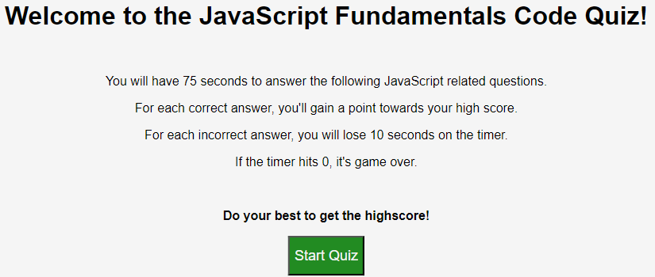

# JavaScript Fundamentals Code Quiz

## Description
This website is a timed quiz on JavaScript fundamentals, that stores high scores for you to compare progress for your peers.

## Usage
When clicking the link below to visit the JavaScript code quiz website, you'll be taken to the instruction/start page of the quiz. After reading the instructions, you can click the start button to begin taking the quiz. After clicking start a timer will begin counting down, if you answer a question correctly you will gain a point towards your high score. If you answer a question incorrectly, it will subtract time from the timer. If all the questions are answered, or the timer hits zero, the game is over. When the game is over, you have the option to save your name/initials with your high score. Do your best to achieve a high score so that you can compare with your peers. 

## Screenshot

## Link
[JavaScript Fundamentals Code Quiz](https://ndufour48.github.io/javascript-fundamentals-code-quiz/)